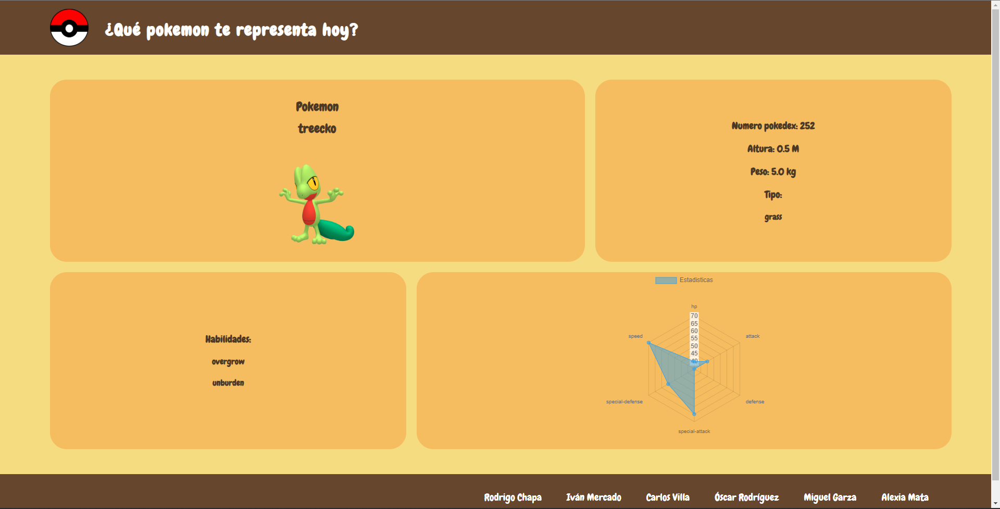

# PokeApp
Alguna vez has querido saber que pokemon eres? Curiosamente yo si JAJA
Te mostramos la web que te muestra que pokemon eres, las estadisticas, habilidades y aspectos generales ✨ 

Visita la pagina en => https://iridescent-sorbet-774a24.netlify.app/

## Preview 

### Bienvenido proyecto PoketApp 
Este proyecto se ha creo como una practica de Ucamp , el cual se diseño con:

- HTML5
- CSS
- JavaScript 
- Vite

### Descripción 
- Graficos con Chart.Js
- Canvas
- Axios para consumo de datos 
- Modularizacion con import y export
- Uso de promesa o async-await
- HTML5
- CSS
- JavaScript


### Como empezar?

Tenemos que colocar estos comandos
```
git clone https://github.com/EzzCream/PokeApp.git
cd PokeApp
npm i
num run dev
```

### 
Equipo 4
- Alexia Mata
- Miguel Garza
- Óscar Rodríguez
- Carlos Villa
- Iván Mercado
- Rodrigo Chapa
